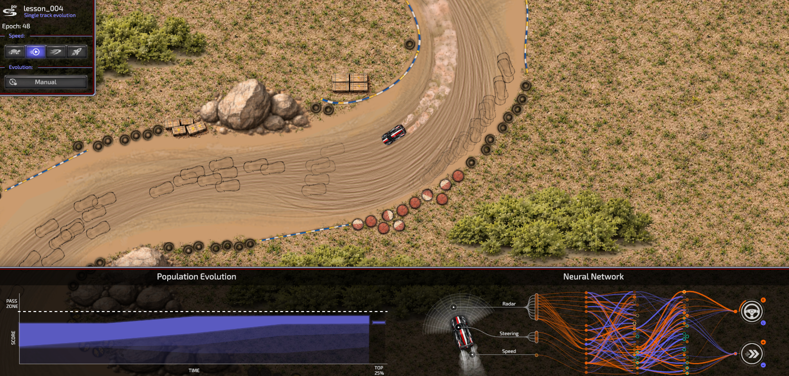
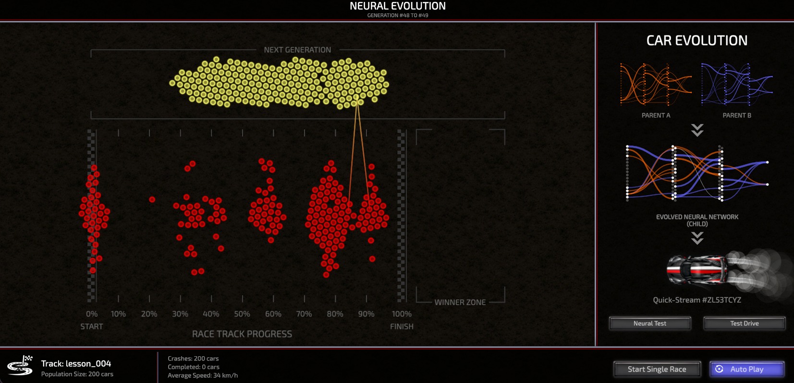
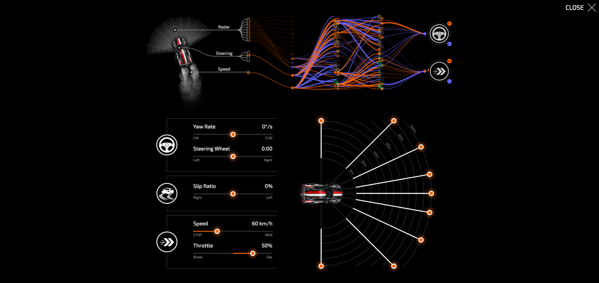

# Neural Racer

Neural Racer is a PixiJS-powered 2D racing sandbox where [neural network](docs/neural_net.md)
populations learn to drive through [neuroevolution](docs/evolution.md). It loads SVG tracks,
spawns simulated cars, and iteratively improves their controllers via
evolutionary strategies (elite carryover, crossover, mutation, hall of fame).

**Live demo**: [jamro.github.io/neural-racer](https://jamro.github.io/neural-racer/)

## What it does
- Renders a track and cars with PixiJS.
- Simulates [driving physics](docs/physics.md) and sensors for many cars in parallel.
- Evolves [neural controllers](docs/neural_net.md) over generations (standard, hall-of-fame, all-track modes) via [genetic algorithms](docs/evolution.md).
- [Persists evolution progress](docs/persistence.md) locally so runs can resume.

## Screenshots
1) Race simulation  


2) Evolution screen  


3) Neural network preview & test  


## Prerequisites
- Node.js 18+ (recommended) and npm.
- A browser with WebGL enabled.

## Install
From the repository root:
```bash
npm install
```

## Run (development)
Start the dev server with hot reload:
```bash
npm run dev
```
Then open `http://localhost:3000`.

## Build (production)
```bash
npm run build
```
Outputs go to `dist/` (served by your host of choice).

## Lint
Run ESLint across `src/`:
```bash
npm run lint
```
Apply auto-fixes where possible:
```bash
npm run lint:fix
```

## Tests
Unit tests run with Jest:
```bash
npm test
```

## Project layout (quick map)
- `src/index.js` – entrypoint wiring the app and HMR.
- `src/app/Application.js` – boot sequence: preload, renderer init, track load, evolution loop.
- `src/engine/simulation` – car physics, sensors, track interaction, view scaling.
- `src/engine/evolution` – generations, epoch runners, hall of fame, persistence.
- `src/presentation` – UI overlays (evo lab, previews, controls).
- `src/resources` – assets, preloader UI, and loader modules (SVG track parsing under `src/resources/loaders/track`).
- `public/tracks/*.svg` – sample tracks loaded at startup.

## Documentation

- **[Evolution System](docs/evolution.md)** – Genetic algorithm design, operators, and multi-track strategies
- **[Neural Network Architecture](docs/neural_net.md)** – Controller design, inputs, outputs, and normalization
- **[Physics Model](docs/physics.md)** – Vehicle dynamics, forces, and simulation details
- **[Persistence & Storage](docs/persistence.md)** – How evolution state is saved and compressed
- **[Project Learnings](docs/learnings.md)** – Practical insights and lessons from development

## Architecture
See [docs/architecture.md](docs/architecture.md) for high-level flow, domains, and data movement.

## Development guide
See [docs/dev_guide.md](docs/dev_guide.md) for workflows (tracks, assets, config, testing, performance).

## Tech stack
- PixiJS 8 for rendering
- Webpack 5 + Webpack Dev Server for bundling and HMR
