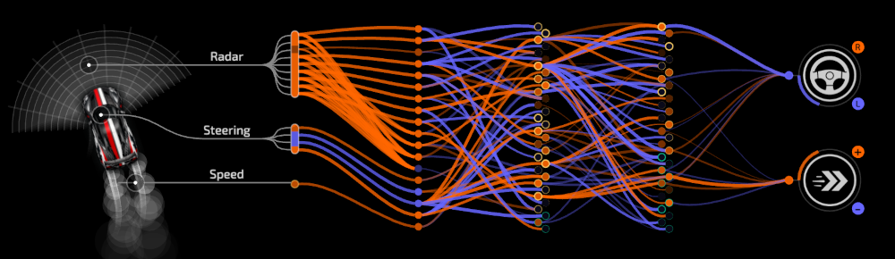

# Neural Network Architecture — Overview & Design Rationale

This document explains **what the controller network is**, **how it is structured**, **what information it consumes and produces**, **how signals are normalized**, and—crucially, **why each design decision was made** based on empirical results during evolution.

---

## What This Network Is

The network is a **feed-forward, fully-connected neural controller** evolved via a [genetic algorithm](evolution.md) to drive a simulated car on irregular racing tracks. The car operates in a [physics simulation](physics.md) that provides realistic vehicle dynamics.

- It runs **every simulation step** for hundreds of cars in parallel.
- It must be **fast, stable under mutation, and interpretable**.
- Learning happens **only through evolution** (no backpropagation).

---

## Architecture at a Glance

- **Topology:** `[18, 32, 32, 2]`
- **Hidden activations:** `leaky_relu`
- **Output activation:** `tanh`
- **Representation:** flat genome encoding all weights and biases

### Why this size
- Large enough to combine geometry + dynamics + memory-like signals.
- Small enough to:
  - evolve reliably,
  - allow meaningful crossover,
  - avoid brittle specialization to a single track.

---

## Layers & Activation Functions

### Hidden Layers (32 → 32, Leaky ReLU)

- Leaky ReLU avoids **dead neurons**, which were common with standard ReLU after mutations.
- Allows neurons to recover after destructive evolutionary steps.
- Produces asymmetric activations that evolve more diverse internal roles.
- Works well with Gaussian mutation and blend crossover.

**Why not tanh or sigmoid inside?**  
They saturated too easily under mutation and slowed evolution.

---

### Output Layer (2 neurons, tanh)

- Outputs are **bounded to `[-1, 1]`** by design.
- Matches the physical interpretation of control signals.
- Prevents runaway acceleration or steering after mutation.
- Keeps output scaling predictable across generations.

---

## Inputs (18 total)

The network receives **three categories of inputs**:
1. **Raw perception**
2. **Derived geometric signals**
3. **Vehicle internal state & control history**

This mix is intentional: adding derived and historical signals accelerates learning by giving evolution richer cues sooner, while raw sensors capture advanced patterns that derived signals alone might miss.

---

### 1. Raw Perception Inputs (Radar)

**Inputs 0–8: Radar Beams**

- 9 directional distance samples around the car.
- Sparse, cheap to compute, track-agnostic.
- Represent the only direct sensing of the environment.

**Why radar beams**
- Tracks have irregular geometry.
- No predefined track centerline or curvature.
- Rays work well with evolutionary learning.

**Limitation**
- Raw distances alone cannot distinguish:
  - gentle vs sharp turns far ahead,
  - braking urgency at speed.

This motivated derived inputs.

---

### 2. Derived Geometric Inputs

These are **not shortcuts**, but **inductive bias** added to make evolution quicker.

#### Input 9: Short-Range Time-To-Collision (TTC)
- Computed from front radar beams + current speed.
- Normalized in such way that it is sensitive at close distances.

**Why**
- Converts distance + speed into time.
- Allows braking decisions without knowing absolute scale.

---

#### Input 10: Long-Range TTC
- Same concept, different normalization.
- Remains informative at larger distances.

**Why**
- Raw radar normalization decays too fast.
- Long-range TTC lets the network anticipate sharp turns earlier.

---

#### Input 11: Left/Right Balance
- Derived from lateral radar beams.
- Smoothed signal of free space imbalance.

**Why**
- Reduces steering oscillation.
- Provides a continuous lateral gradient instead of discrete comparisons.

---

#### Input 12: Safe Direction
- Angle of maximum free space from radar.
- Low-frequency, smoothed signal.

**Why**
- Helps in ambiguous geometry.
- Acts as a fallback when beams look symmetric.
- Prevents deadlocks and hesitation.

---

### 3. Control History & Vehicle State

These inputs let the network reason about **dynamics**, not just geometry.

#### Input 13: Previous Turn Control
#### Input 14: Previous Throttle Control

**Why**
- Approximates temporal memory without recurrence.
- Enables damping, smooth arcs, and correction detection.
- Makes evolution affect *changes in behavior*, not absolute commands.

---

#### Input 15: Yaw Rate
- Angular velocity of the vehicle.

**Why**
- Detects understeer / oversteer.
- Allows stabilization and drift recovery.
- Prevents late over-correction.

See [physics.md](physics.md) for details on how yaw rate is computed.

---

#### Input 16: Slip Ratio
- Measure of lateral traction loss.

**Why**
- Distinguishes controlled drift from loss of control.
- Enables high-speed cornering strategies.
- Required once physics included slip.

See [physics.md](physics.md) for details on slip angle computation and the tire model.

---

#### Input 17: Speed
- Normalized vehicle speed.

**Why**
- Prevents "drive slow everywhere" solutions.
- Enables speed-dependent braking and steering.
- Essential for generalization across tracks.

---

## Input Normalization

All inputs are normalized **before entering the network** to keep evolution stable.

### Principles
- Values are scaled to roughly `[-1, 1]` or `[0, 1]`.
- Non-linear mappings are preferred when sensitivity near zero matters.
- No input encodes absolute track-specific units.

### Examples
- Radar distances → exponential or bounded decay.
- TTC → exponential or capped linear mapping.
- Speed → normalized by max speed.
- Yaw rate → non-linear (e.g. `tanh`) to amplify small values.
- Balance → already normalized to `[-1, 1]`.

**Why this matters**
- Evolution is sensitive to scale.
- Poor normalization caused:
  - saturation,
  - dead neurons,
  - slow convergence.

---

## Outputs (2)

### Output 0: Turn
- `[-1, 1]` → full left to full right steering.

### Output 1: Throttle
- `[-1, 1]`
  - positive = accelerate
  - negative = brake

**Why this mapping**
- Symmetric control space.
- Simplifies physics interface.
- Makes mutation and crossover safer and more interpretable.

---

## Why This Architecture Works with Evolution

This network is shaped as much by **evolutionary constraints** as by the driving task:

- Bounded activations prevent catastrophic mutations.
- Redundant capacity allows specialization and later recombination.
- Flat genome aligns with mutation and crossover operators.
- Derived inputs reduce search space without hard-coding behavior.

It is **not minimal**, but intentionally *robust*.

---

## Summary

This architecture balances:
- raw perception vs abstraction,
- expressiveness vs evolvability,
- specialization vs generalization.

It is designed to:
- survive aggressive mutation,
- recover from bad generations,
- scale across tracks,
- remain diagnosable and explainable.

**The result is not a perfect driver—but a network that evolution can reliably improve.**

For practical insights on what worked and what didn't during development, see [learnings.md](learnings.md).